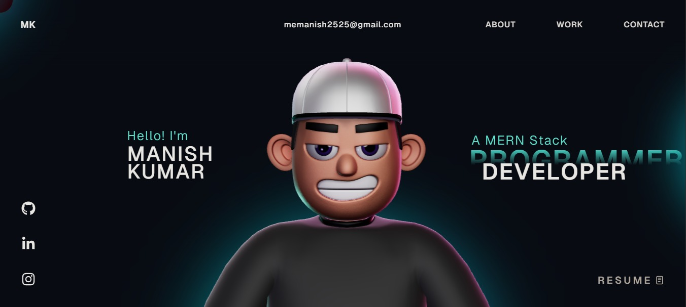

# Manish Kumar Portfolio 🚀

Welcome to the source code of my **personal developer portfolio website**.
This portfolio showcases my skills, projects, and contact information as a **MERN Stack Developer**.

## About

I am a MERN Stack Developer and BCA student at Viveka Global University.
This portfolio highlights my work, technical skills, and projects built using modern web technologies.

## Tech Stack 🛠️

- React
- TypeScript
- GSAP
- Three.js
- WebGL
- HTML
- CSS
- JavaScript

## Preview

## Contact

📧 Email: [memanish2525@gmail.com](mailto:memanish2525@gmail.com)
🐱 GitHub: https://github.com/manishkumar2543
💼 LinkedIn: https://www.linkedin.com/in/manish-kumar-69b603290

## License

This project is open source and available under the MIT License.
